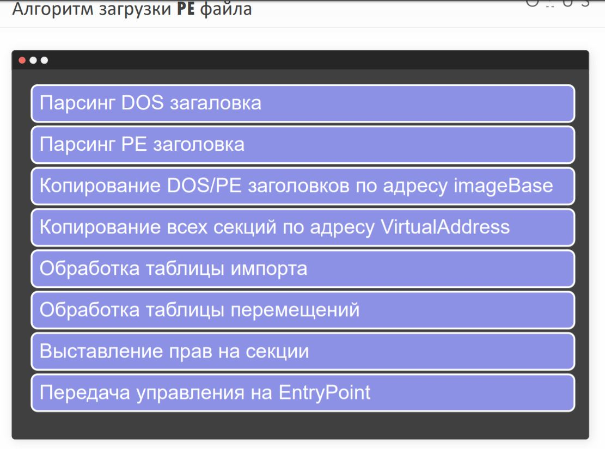
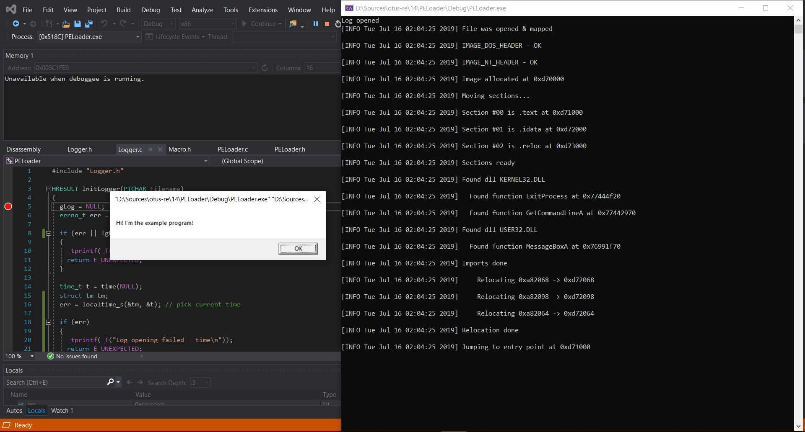

# WinApi функции. Перехваты WinApi функций 

## Pe Loader

Реализовать простейший Pe Loader, который будет считывать с диска Pe (exe) из памяти и запускать его.
Pe файл брать тот, который выдаёт MessageBox и скомпилирован на FASMЕ.
Критерии оценки: 1. Должна происходить обработка таблицы импорта
2. Должна происходить обработка таблицы релокаций

## Решение

