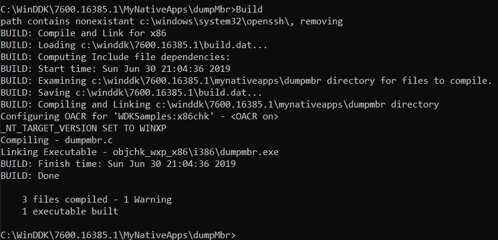
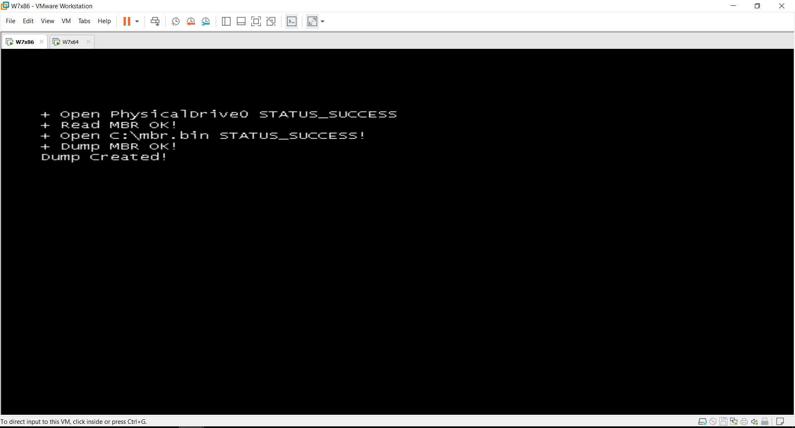
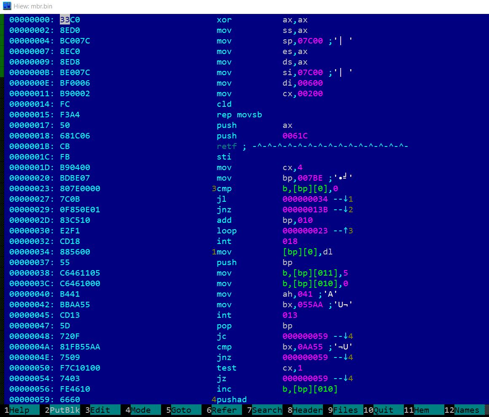

# Программирование Native приложений

## Сборка Native приложения с помощью WDK

Неодходимо собрать приложение dumpMbr.7z, установить его на виртуальную машину и перезагрузить её.

## Решение

1. Необходимо установить DDK (WDK7)
2. Запустить x86 Checked Build Environment
3. Build

4. Скопировать собранное решение на виртаульную машину
5. Скопировать в C:\Windows\System32
6. Добавить запись в реестре:

**
[HKEY_LOCAL_MACHINE\SYSTEM\CurrentControlSet\Control\Session Manager]
"BootExecute"=hex(7):61,75,74,6f,63,68,65,63,6b,20,61,75,74,6f,63,68,6b,20,2a,\
  00,64,75,6d,70,6d,62,72,00,00
**  

7. Перезагрузить

8. После старта можно наблюдать результат работы нашего приложения

## Описание приложения

Сразу после старта приложения оно открывает диск на чтение и читает MBR.
Байты копируются в C:/mbr.bin.
Далее приложение ожидает ввода от пользователя (esc)