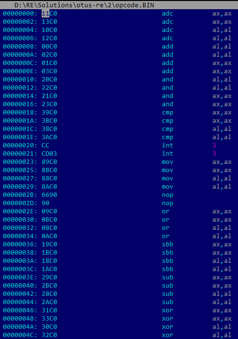

# Представление данных, кода, опкоды команд

## Задание

Неодходимо составить список как можно больших команд, которые будут иметь один и тот же смысл, но разные опкоды

## Результат

Смотри файл opcode.BIN

## Решение
1. Задача решена методом простого перебора команд взятых с этой вики: https://en.wikipedia.org/wiki/X86_instruction_listings

## Возможное дальнейшее развитие
1. Попробовать кинуть в бинарный файл простую последовательность от 0x0000 до 0xFFFF.
2. Открыть с помощью Hiew в режиме Decode.
3. Написать небольшой скрипт для поиска повторяющихся команд.
