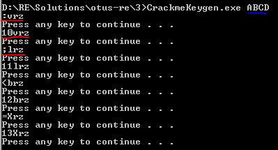

# Арифметические, логические команды. Команды условного/безусловного перехода

## Задание 1 - Написать keygen к программe crackme.EXE

Необходимо дизассемблировать программу и написать генератор валидных пар login:password.
Критерии оценки: В качестве логина и пароля будут рассматриваться комбинации слов из латинских букв блиной не более 30 символов.

### Результат

База файла смотри crackme.i64
CrackmeKeygen.exe - кейген

CrackmeKeygen - vs проект с исходниками keygen реализовано на C.

Кейген аргументом принимает имя и затем генерирует валидные серийники.

### Возможное дальнейшее развитие
1. Будет удобнее если keygen будет кидать список валидных серийников в файл (можно будет реализовать автотест)

### Возникшие трудности

Работать и читать код в ida было слишком просто, сложность возникла с реализацией алгоритма.

