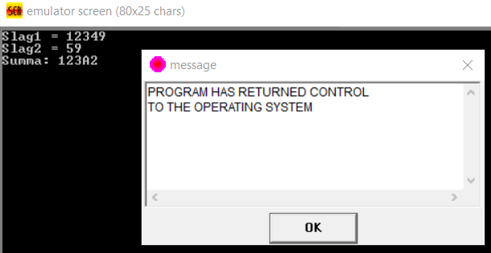

# Прерывания BIOS

## Задание - Калькулятор суммы

Написать программу, принимающую на вход два слагаемых в виде hex цифр, считает сумму и выводит её не экран тоже, в hex виде.
Критерии оценки: Пример ввода:
Slag1 = 12345
Slag2 = 2
Summa: 12347

### Результат

Решение - code.asm

### Возникшие трудности

Ассемблер легче читать, чем писать на нем

### Исправления и недочеты

Использование прерываний BIOS
Диапазон  Описание
00h – 1Fh прерывания BIOS
20h – 3Fh прерывания DOS
40h – 5Fh зарезервировано
60h – 7Fh прерывания пользователя

