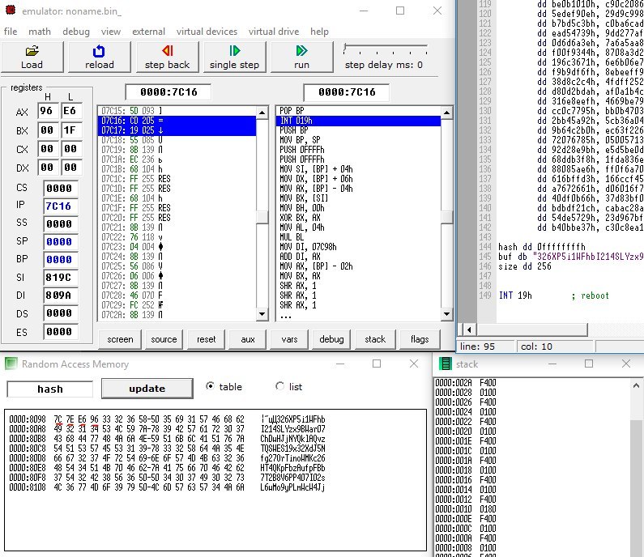
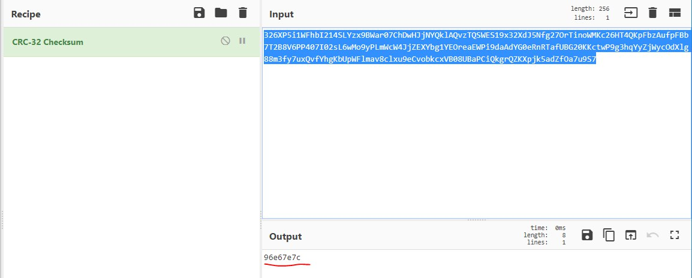

# Арифметические, логические команды. Команды условного/безусловного перехода

## Задание - Crc32

Переписать программу с MIPS ассемблера на 8086.
Критерии оценки: Захардкодить рандомную строку в 0x100 байт и от неё считать хеш. Функция, выполняющая расчёты должна быть STDCALL

### Результат

Решение - crc32_8086.asm

строка - "326XP5i1WFhbI214SLYzx9BWar07ChDwHJjNYQklAQvzTQSWES19x32XdJ5Nfg27OrTinoWMKc26HT4QKpFbzAufpFBb7T2B8V6PP407I02sL6wMo9yPLmWcW4JjZEXYbg1YEOreaEWPi9daAdYG0eRnRTafUBG20KKctwP9g3hqYyZjWycOdXlg88m3fy7uxQvfYhgKbUpWFlmav8clxu9eCvobkcxVB08UBaPCiQkgrQZKXpjk5adZfOa7u9S7"

посчитанный hash = 0x96e67e7c

