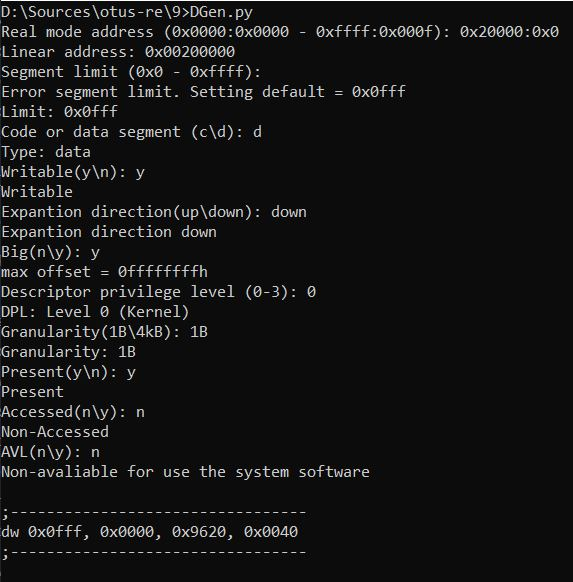
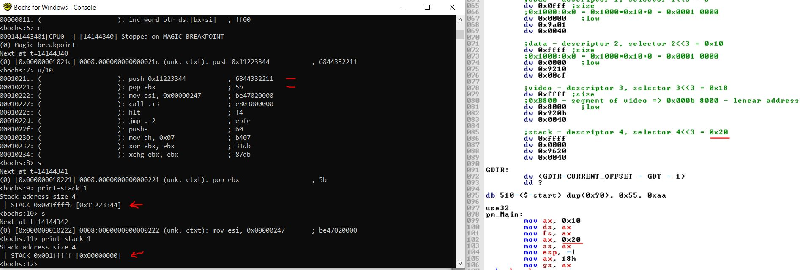
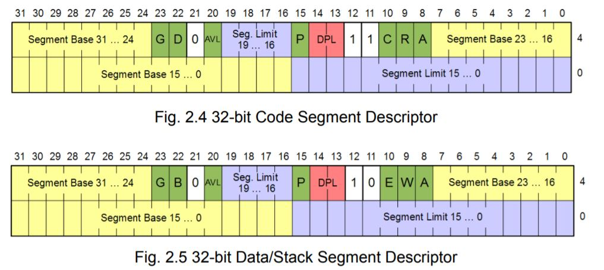
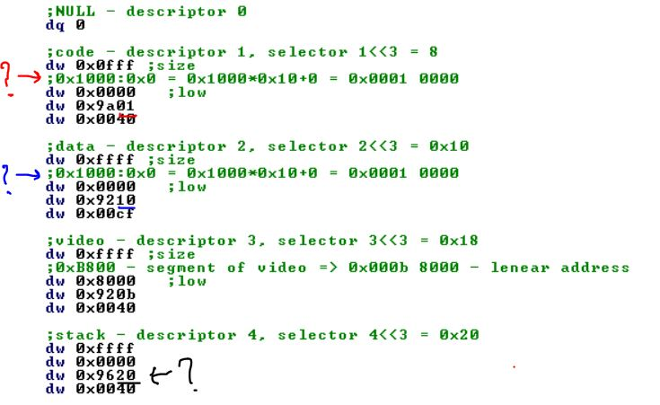

# Страничная организация памяти 

## Задача 1 - Генератор дискрипторов

Написать программку (лучше на python, но можно и на других ЯП), которая на вход будет принимать: адрес сегмента, лимит сегмента, права (чтение/запись/исполнение) и будет возвращать сформированный дескриптор сегмента

Решение последовательно спрашивает элементы дискриптора (но можно просто скипать, чтобы получить дефолтные значения)

## Задача 2 - Дискриптор сегмента стэка

Добавить дескриптор сегмента, для стека в segmodel.asm
Добавлен четвертый дескриптор с селектором = 0x20. Работа стэка проверена

## Дополнительный материал

http://www.ics.p.lodz.pl/~dpuchala/LowLevelProgr/Old/Lecture2.pdf

## Вопросы

1) На чем основан выбор адреса сегмента?

